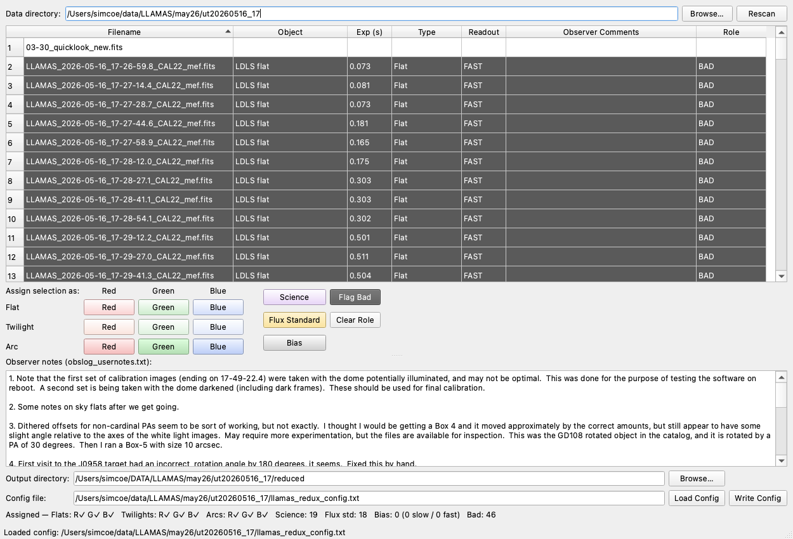

# Stage 1 — Setup & configuration (`reduxSetupGUI`)

⟵ [Back to overview](README.md) · Next: [Running the reduction ⟶](02-running-the-reduction.md)

Every reduction is driven by a **plain-text config file** that lists which raw frames play which role
(flats, arcs, science, standards, bias) and where the outputs go. You *can* write that file by hand
(see [`example_config.txt`](../../llamas_pyjamas/example_config.txt)), but the intended entry point is
the **reduction setup GUI**, which scans your raw night, classifies every frame from its FITS header,
lets you fix the classification, builds the master bias, and writes the config for you.

Source: [`llamas_pyjamas/Utils/reduxSetupGUI.py`](../../llamas_pyjamas/Utils/reduxSetupGUI.py)

## Launch it

```bash
python -m llamas_pyjamas.Utils.reduxSetupGUI /path/to/raw_night -o config.txt
```

Both arguments are optional — omit the directory to get a browse dialog, omit `-o` to default the
config to `<raw_night>/llamas_redux_config.txt`. The output directory defaults to
`<raw_night>/reduced/`.



*The setup GUI on a real may26 night. Each raw exposure is one row; the pipeline role is shown (and
colour-tinted) in the last column. The observer's `obslog_usernotes.txt` is displayed in the lower
pane, and the summary bar at the bottom tallies what has been assigned.*

## What it does

1. **Scans the directory.** It reads the primary header of every `*.fits` MEF frame (skipping
   `white`/`diff` quicklook products) and tabulates *object*, *exposure time*, *type* (from the
   `PRODCATG` header — Bias / Dark / Flat / SkyFlat / Arc / Science), *readout mode*, and the
   observer's comment.

2. **Shows the observer's notes.** `obslog_usernotes.txt` from the raw directory is displayed so you
   can honour night-log caveats (e.g. "the first flats were taken with the dome illuminated — use the
   second set").

3. **Recommends flux standards automatically.** Science pointings that fall on a catalogued
   spectrophotometric standard are cross-matched and pre-tagged as **Flux Standard** — a
   recommendation you can override.

4. **Lets you assign roles.** Select rows and click a role button:

   | Role | Multi-file? | Purpose |
   |------|-------------|---------|
   | Red / Green / Blue **Flat** | one each | dome/lamp flat per colour — fibre tracing + pixel flat |
   | Red / Green / Blue **Twilight** | one each | twilight flat — fibre-to-fibre throughput (recommended) |
   | Red / Green / Blue **Arc** | one each | arc lamp — wavelength refinement (optional) |
   | **Science** | many | the science exposures (including dithers) |
   | **Flux Standard** | many | standard-star exposures for the sensitivity function |
   | **Bias** | many | raw bias frames → combined into a master bias |
   | **Flag Bad** | many | frames to exclude (recorded for the record, unused) |

   Right-click a row to preview the raw MEF in SAOImage DS9 (needs `ds9` running + `pyds9`).

5. **Builds the master bias.** When you click **Write Config**, any frames tagged *Bias* are
   median-combined per readout mode into `slow_master_bias.fits` / `fast_master_bias.fits`
   (via [`BiasLlamas`](../../llamas_pyjamas/Bias/llamasBias.py)). If you already have master biases,
   leave *Bias* empty and the pipeline uses the packaged ones.

6. **Writes the config.** The chosen paths are substituted into the annotated template; unassigned
   flat/twilight/arc keys are commented out so the pipeline falls back to its defaults. Re-loading an
   existing config with **Load Config** maps its selections back onto the table, so you can revise a
   previous night non-destructively.

## What you get

- `slow_master_bias.fits` / `fast_master_bias.fits` (if you combined biases)
- `config.txt` (or `<raw_night>/llamas_redux_config.txt`) — the input to [stage 2](02-running-the-reduction.md).

The config is a simple `key = value` text file (`#` comments; comma-separated lists; **paths not
quoted**). The keys the GUI fills — and the many optional tuning keys it leaves at their defaults —
are documented inline in [`example_config.txt`](../../llamas_pyjamas/example_config.txt) and
summarised in the [Reference page](07-reference.md#config-keys).

> **Minimum to proceed:** at least one *Science* frame and the three *Flat* colours. The GUI will warn
> (but let you continue) if twilights, arcs, or bias are missing — it falls back to packaged
> calibrations for those.

⟵ [Overview](README.md) · Next: [Running the reduction ⟶](02-running-the-reduction.md)
