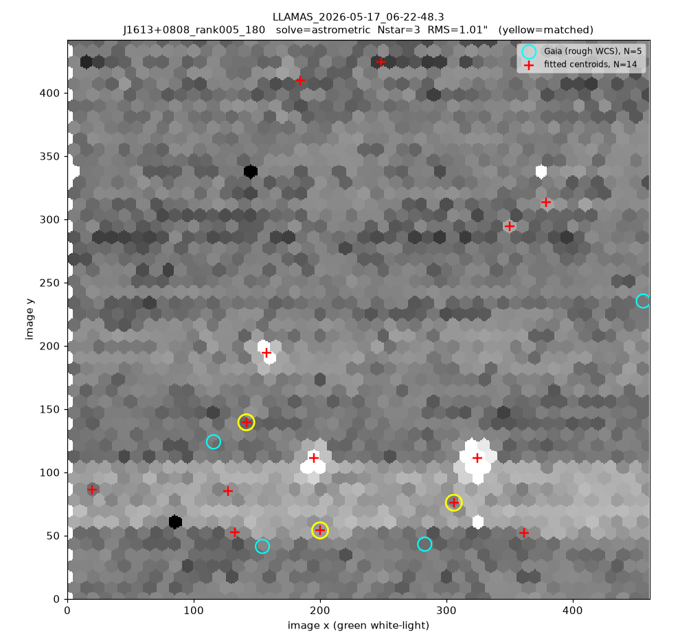

# Stage 3 — Registration (per-fibre WCS)

⟵ [Running the reduction](02-running-the-reduction.md) · Next: [Combining the dithers ⟶](04-combining-dithers.md)

To stack dithers on the sky — and to put spectra at real RA/DEC — every fibre needs an accurate
celestial position. The reduction ([stage 2](02-running-the-reduction.md)) writes only a
**provisional** WCS from the telescope pointing and rotator angle. Because the real TCS pointing error
is often **4–6″**, that provisional WCS is not good enough to co-add dithers cleanly. Registration
refines it by matching in-field **Gaia** stars.

Source: [`llamas_pyjamas/Utils/register.py`](../../llamas_pyjamas/Utils/register.py) ·
GUI: [`CubeViewer/cubeViewRegister.py`](../../llamas_pyjamas/CubeViewer/cubeViewRegister.py)

## How it works

Registration does a live Gaia cone-search seeded by the rough WCS, fits fibre-space centroids for the
brightest sources, and solves for the offset (and, per block, rotation) that best aligns them. Match
trust is by **consensus** — two or more stars agreeing on a common shift, or one dominant standard —
not by shift magnitude, so a large-but-consistent TCS error is corrected safely.



*A registration QA plot (real J1613 frame). The hex-lattice white-light image with **Gaia sources**
(cyan), **fitted fibre centroids** (red +), and the **matched pairs** used in the solve (yellow). The
title reports the solve type, the number of stars, and the residual RMS.*

The refined per-fibre `RA/DEC` is written back into both the `FIBERMAP` and `FIBERWCS` tables (and the
white-light image WCS) of every colour, so the registration is stored **on disk** with the RSS — later
stages just read it.

## Doing it in the CubeViewer (recommended)

Open a reduced RSS (or its white-light) in the CubeViewer and use the **WCS** menu:

```bash
python -m llamas_pyjamas.CubeViewer   # File ▸ Open, then the WCS menu
```

| WCS menu item | What it does |
|---------------|--------------|
| **Auto-register exposure** | solve one frame against Gaia |
| **Auto-register block** | solve a group of dithers sharing one rotation (one rotation fit, per-frame shifts) |
| **Refine WCS interactively…** | manual fallback: grab a star at the DS9 crosshair, snap to its fibre centroid, pair it to Gaia (or a typed RA/DEC), live-solve, **Accept** to write |
| **Show registration QA** | the plot above |
| **Reset to rough WCS** | revert to the header-based provisional WCS |

The interactive dialog exists for the hard cases (sparse fields, a frame with a wrong rotation). It
overlays Gaia as green circles; you click the star, it snaps to the flux-weighted fibre centroid, and
you can hold the block's rotation fixed while it fits only the translation.

## Doing it programmatically

```python
from llamas_pyjamas.Utils.register import register_exposures
register_exposures(list_of_rss_paths)   # auto-groups by OBJECT + rotator, solves each block
```

`register_exposure` (one frame), `register_block` (a rotation-sharing group, optionally with
`fixed_rotation=…`), and `reset_rough` (revert) are the other entry points.

## What to check

- Aim for a residual **RMS < ~0.25″**; the QA title reports it per frame. A frame that won't converge
  (too few Gaia stars, or a wrong rotation) is the one to fix interactively.
- On the may26 fields, ~33 of 35 frames refine automatically. A single frame with the rotation off by
  180° is a known failure mode — fix it with **Auto-register block** holding the correct rotation, or
  interactively.

> **Why it matters for stacking:** the co-add places every fibre by its `FIBERWCS` position. Good
> registration is what keeps the stacked PSF sharp — mis-registered dithers blur the combined image
> (see the PSF discussion in [stage 5](05-science-products.md)).

⟵ [Running the reduction](02-running-the-reduction.md) · Next: [Combining the dithers ⟶](04-combining-dithers.md)
