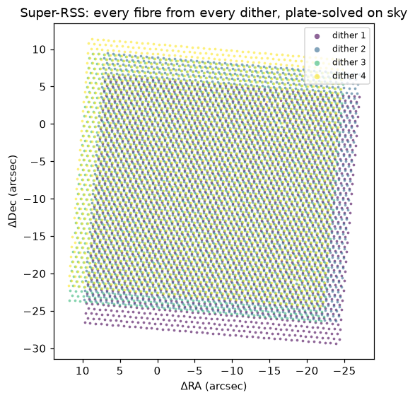
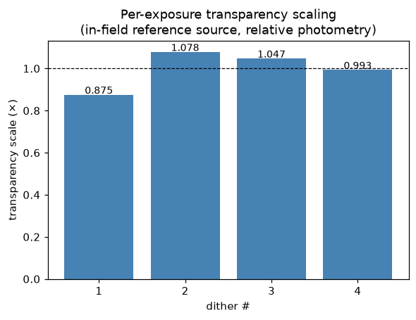
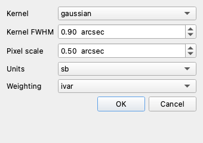

# Stage 4 — Combining the dithers

⟵ [Registration](03-registration.md) · Next: [Science products ⟶](05-science-products.md)

This is where the registered dithers of one field become a **single deep product** — a cube, a mosaic
image, and depth maps. The combine is built around an in-memory **super-RSS**.

Source: [`llamas_pyjamas/Combine/`](../../llamas_pyjamas/Combine/) —
[`superRSS.py`](../../llamas_pyjamas/Combine/superRSS.py),
[`coadd.py`](../../llamas_pyjamas/Combine/coadd.py),
[`cube.py`](../../llamas_pyjamas/Combine/cube.py),
[`combineField.py`](../../llamas_pyjamas/Combine/combineField.py)

## The idea: build the super-RSS, then take views of it

Rather than resample each exposure and stack images, the pipeline gathers **every fibre from every
dither** into one table — the *super-RSS* — tagged with its native wavelength, its inverse-variance
weight, its exposure, and its plate-solved RA/DEC. All the deliverables are then *views* of that one
table, and the (single) spatial/spectral resample happens only at the very end.



*Every green fibre from the four J2151 dithers, plotted at its registered sky position and coloured by
dither. The small telescope offsets between dithers interleave the fibres and fill the
inter-lenslet gaps — this denser, irregular sampling is what the co-add resamples onto a grid.*

## Handling variable transparency

Weather changes between dithers, so each exposure has a different throughput. Before co-adding, the
combine can **scale every exposure to a common photometric system** using an in-field reference
source (the bright quasar/star): it measures that source's flux in each exposure and scales the
fainter (cloudier) ones up, adjusting the variance so inverse-variance weighting still down-weights
the noisier frames correctly.



*Relative transparency scale per J2151 dither. On this field the corrections are small (±10 %) — but on
a night with passing cloud they matter, and they are always the right first step for relative
photometry.*

## Doing it in the CubeViewer (recommended)

```bash
python -m llamas_pyjamas.CubeViewer
```

**Combine ▸ Combine field into cube…** → pick the dithers from the observation log, and a small
options dialog appears:



| Option | Meaning | Default |
|--------|---------|---------|
| **Kernel** | spatial gridding kernel shape (`gaussian` / `tophat`) | gaussian |
| **Kernel FWHM** | the gridding scale (see box below) | 0.9″ |
| **Pixel scale** | output spaxel size | 0.5″ |
| **Units** | `sb` (surface brightness, for diffuse emission) or `flux` (per spaxel) | sb |
| **Weighting** | `ivar` (inverse-variance), `uniform`, or `exptime` | ivar |

It then builds a cube for **every** channel on one shared grid, opens it, and saves the cubes to
`reduced/combined/`. From there the whole spectrum is available at each spaxel, and the
[Extraction](05-science-products.md) and narrowband tools work directly.

> **About the kernel FWHM.** The gridding kernel fills the inter-lenslet gaps and lands the irregular
> dithered fibres on a regular grid — but it also *softens the rendered image* (effective image PSF ≈
> √(source² + kernel²)). Use ~0.9″ for faint **diffuse** emission (it acts as a near-matched filter);
> drop to ~0.5–0.6″ for a **sharper** view of compact structure, at the cost of more holes/noise in
> shallow-coverage regions. This kernel affects only the rendered cube/image — the point-source
> [optimal extraction](05-science-products.md) works in fibre space and is **not** softened by it.

## Doing it from the command line

[`combineField`](../../llamas_pyjamas/Combine/combineField.py) produces the same products headlessly:

```bash
# a deep cube for one field, transparency-scaled, all channels
python -m llamas_pyjamas.Combine.combineField \
    --dir /path/to/reduced --object J2151 --cube --scale-transparency

# a broadband (or narrowband) co-added IMAGE instead of a cube
python -m llamas_pyjamas.Combine.combineField \
    --dir /path/to/reduced --object J2151 --band 5000 6000 --units sb --png
```

Useful options: `--channels`, `--band LO HI`, `--units sb|flux`, `--weight ivar|uniform|exptime`,
`--kernel`, `--fwhm`, `--pixscale`, `--scale-transparency`, `--keep-bad-fibres`, `-o out.fits`,
`--png`. Outputs default to `reduced/combined/`. See [Reference](07-reference.md#combinefield) for the
full list.

## What you get

- **Cube(s)** `reduced/combined/<field>_cube_{blue,green,red}.fits` — (RA, DEC, wavelength), with
  `VAR`, `COVERAGE`, `NEXP` extensions and a wavelength table. The cube header records the
  contributing RSS paths, so re-opening it rebuilds the super-RSS on the fly (no giant file needed).
- **Co-add image** (image mode) — a DS9-ready FITS with the same `VAR`/`COVERAGE`/`NEXP` maps.
- **Depth maps** — `COVERAGE` (fibres per pixel) and `NEXP` (distinct dithers), the deep-core /
  shallow-halo record shown on the [overview page](README.md#what-stacking-a-dithered-field-means-here).

Broken fibres (a couple per exposure that read strongly negative) are masked as *no-data* by default so
they don't punch holes in the co-add; pass `--keep-bad-fibres` to disable that.

## A caveat: sky-subtraction striping

The faint **diagonal striping** you may see in a deep co-add is an *additive* per-detector
sky-subtraction residual, not a transparency effect — so transparency scaling correctly does not
remove it. Because it is coherent across dithers, it does not average down with more exposures either.
It is an upstream sky-subtraction issue; the combine is faithfully co-adding the input residuals.
Clean diffuse work at the faintest levels is gated by that (separate, ongoing) sky work.

⟵ [Registration](03-registration.md) · Next: [Science products ⟶](05-science-products.md)
