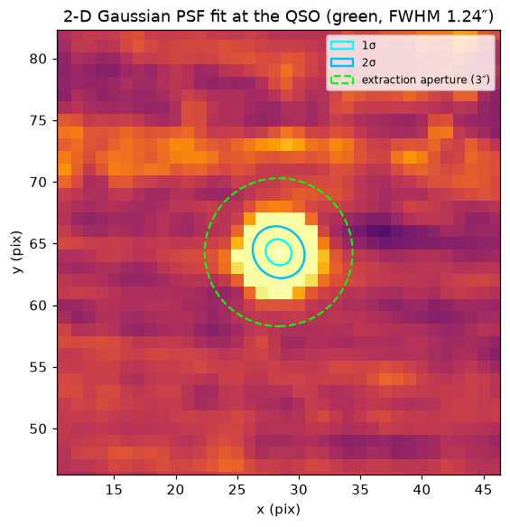
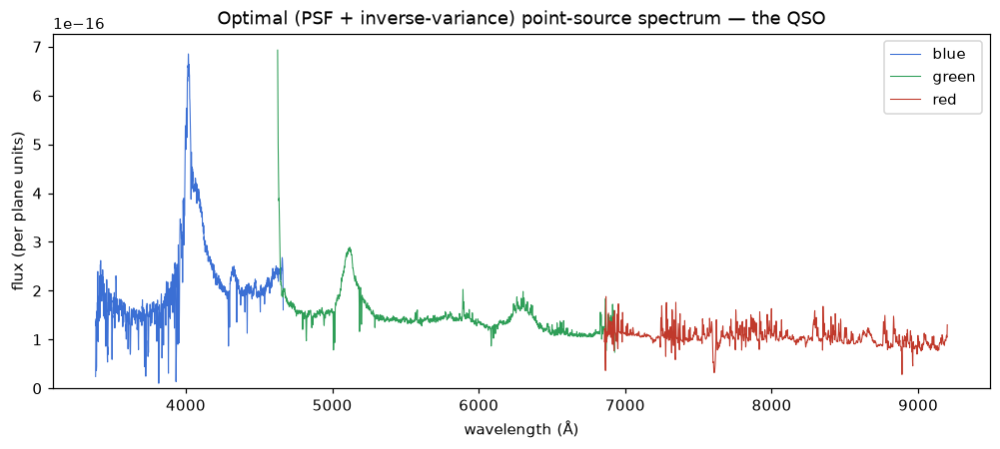
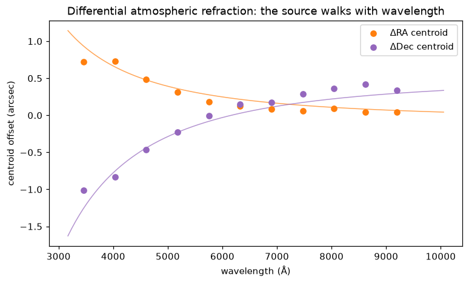
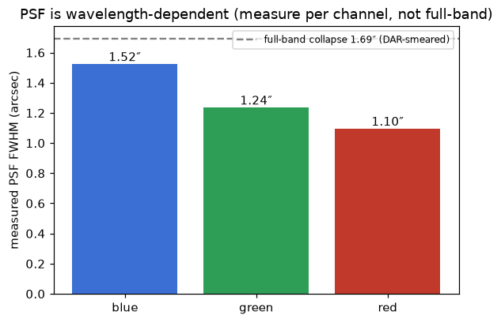
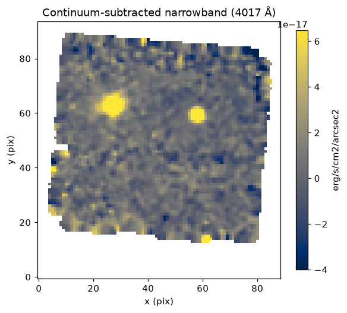
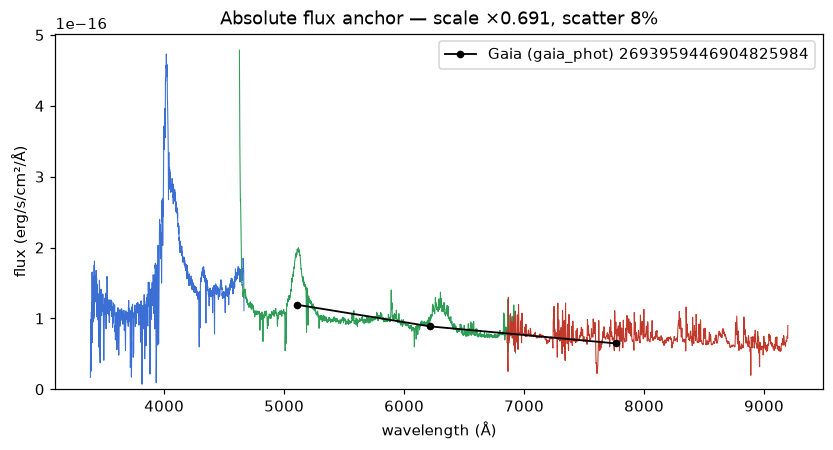

# Stage 5 — Science products

⟵ [Combining the dithers](04-combining-dithers.md) · [Reference ⟶](07-reference.md)

With a combined field open in the CubeViewer, the **Extraction** menu turns the stack into science:
optimal point-source spectra, continuum-subtracted narrowband images, and an absolute flux scale tied
to Gaia. All of these run on the **super-RSS** (rebuilt from the cube's provenance on open), so they
use the native, un-softened fibre sampling — not the gridded cube.

Source: [`Combine/spectrum.py`](../../llamas_pyjamas/Combine/spectrum.py),
[`Combine/cube.py`](../../llamas_pyjamas/Combine/cube.py) (narrowband),
[`Combine/fluxanchor.py`](../../llamas_pyjamas/Combine/fluxanchor.py)

## Optimal point-source spectra

Put the DS9 crosshair on a source and choose **Extraction ▸ Optimal spectrum at crosshair**. The tool
fits a 2-D Gaussian to the source's spatial profile and does a PSF- and inverse-variance-weighted
(Horne) extraction across all dithers — the statistically optimal spectrum for a point source, and
sharper/higher-S/N than a plain aperture sum.

*The fitted profile is drawn back into DS9 as 1σ / 2σ ellipses (cyan) with the extraction aperture
(green dashed). The extraction weight comes from this fit, so a round source gets a round profile and
an elongated one a tilted ellipse.*

*The resulting quasar spectrum across all three channels (blue/green/red), stitched at their native
resolution.*

## Differential atmospheric refraction (DAR)

If the atmospheric dispersion compensator was imperfect, a source's centroid **walks with wavelength**
— bluer light is refracted further. The extractor tracks this and re-centres the profile per
wavelength, so blue flux isn't lost.

*The flux-weighted centroid of the J2151 quasar vs wavelength. The walk is fit as a physically-shaped
function of air refractivity (robust against over-fitting faint blue data), and the extraction follows
it. Without this tracking, the bluest wavelengths would fall partly outside a fixed aperture.*

### A note on the measured PSF

The PSF is **wavelength-dependent** — measure it *per channel*, not as a full-band collapse. On J2151:

*The quasar's measured FWHM is 1.10″ (red), 1.23″ (green), 1.53″ (blue) — bluer is broader (seeing +
DAR). A single full-band collapse (dashed) reads ~1.7″ and looks elongated, because it smears the DAR
walk together — that number is **not** the seeing. The stacked PSF matches a single exposure's,
confirming the dithers are well-registered.*

## Narrowband (diffuse emission) images

**Combine ▸ Narrowband line image…** extracts a continuum-subtracted surface-brightness image in a
window around a chosen wavelength — the headline product for faint extended emission (e.g. Lyα around
a quasar pair at the pair's redshift).

*A continuum-subtracted narrowband image (surface brightness). The continuum is estimated from
flanking windows and removed, isolating line emission; the shared continuum striping largely cancels.*

## Absolute flux anchor (Gaia)

**Extraction ▸ Anchor cube flux to Gaia (at crosshair)** ties the stacked flux to the true SED of an
in-field Gaia source — fixing the zero-point and aperture loss at once, using a source already in the
frame (no separate standard needed).

*The extracted point-source spectrum scaled onto the Gaia reference SED. The colour scatter of the
ratio is a built-in diagnostic: a slope flags a residual throughput/colour error or — for a variable
quasar — an epoch mismatch.*

- **Bright sources** (roughly G < 17.6) use the Gaia DR3 **XP** flux-calibrated SED — SED-independent,
  so it works for a quasar or a star (needs `gaiaxpy` + network).
- **Faint sources** with no XP spectrum fall back automatically to a coarse SED built from the Gaia
  **G/BP/RP broadband** magnitudes; the result is flagged *approximate* in the dialog.

> **Which source to anchor on:** in these fields the in-field Gaia "stars" are quasars in two of three
> fields and a genuine star in the third. The star field is the cleanest end-to-end validation of the
> absolute chain (stable, stellar SED); quasar anchors carry a variability/epoch caveat, which the
> colour-scatter diagnostic will surface.

## What you get

- Optimal 1-D spectra (per channel) for any source, at native resolution.
- Continuum-subtracted narrowband surface-brightness images.
- An absolute flux scale (applied to the open cube; recorded in its header).

⟵ [Combining the dithers](04-combining-dithers.md) · [Reference & troubleshooting ⟶](07-reference.md)
