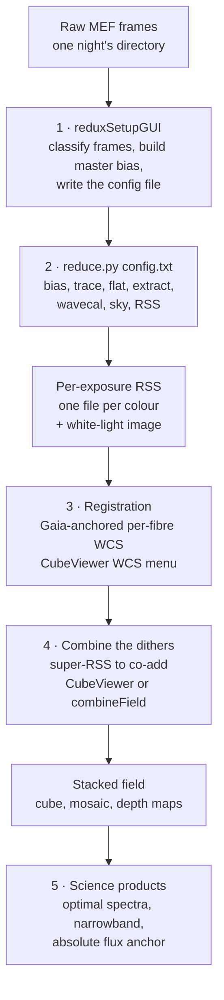
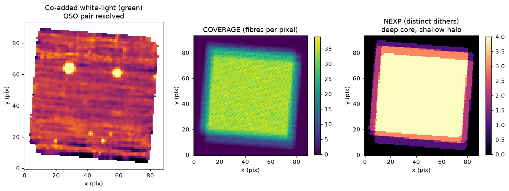

# LLAMAS reduction & stacking — end-to-end workflow

This guide walks a new LLAMAS observer through the **complete pipeline**, from a directory of raw
detector frames to a **stacked, dithered field** (a co-added cube or mosaic) ready for science. It is
task-oriented: at each stage it says *what you run*, *what it produces*, and *what to check*.

Every figure below is generated from a real may26 field (**J2151+0235**, a quasar pair observed as
four dithers), so the products you see are what you should expect on your own data.

> **New here?** Install the package and fetch the bundled calibrations first — see the repository
> [`README.md`](../../README.md) (§ *Installation* and § *Downloading auxiliary files*). This guide
> assumes `llamas_pyjamas` is importable and the master bias / trace / reference-arc calibration
> files are in place.

---

## The big picture



The pipeline's **per-exposure deliverable** is a set of row-stacked-spectra (RSS) files — one per
camera colour — carrying flux-calibrated spectra plus a per-fibre sky position. Stacking multiple
dithers of the same field into a deep cube/mosaic happens **afterwards**, interactively in the
CubeViewer or from the command line.

---

## The stages

| # | Stage | You run | Produces |
|---|-------|---------|----------|
| 1 | [Setup & config](01-setup-and-config.md) | `reduxSetupGUI` | master bias + `config.txt` |
| 2 | [Running the reduction](02-running-the-reduction.md) | `reduce.py config.txt` | per-exposure RSS + white-light |
| 3 | [Registration (WCS)](03-registration.md) | CubeViewer *WCS* menu | Gaia-anchored per-fibre RA/DEC |
| 4 | [Combining the dithers](04-combining-dithers.md) | CubeViewer *Combine* / `combineField` | stacked cube / mosaic + depth maps |
| 5 | [Science products](05-science-products.md) | CubeViewer *Extraction* menu | optimal spectra, narrowband, flux anchor |
| — | [Reference & troubleshooting](07-reference.md) | — | file formats, config keys, cheat-sheet |

Read them in order the first time; afterwards each page stands alone.

---

## What "stacking a dithered field" means here

Each LLAMAS field in the example programme is a **deep dithered stack of one pointing** (not a tiled
mosaic): the same field is revisited with small telescope offsets, and half the data is taken at a
180° rotation to fill the ~7 % inter-lenslet gaps. Combining them gives a **deep core and a shallow
halo** automatically — the pipeline tracks this with a coverage/depth map rather than trimming.



*Left:* the co-added white-light image of J2151 — the quasar **pair is resolved**. *Middle:* fibre
coverage per output pixel. *Right:* the number of distinct dithers (NEXP) — deep 4-exposure core,
shallow 1-exposure halo. (The faint diagonal striping is a known additive sky-subtraction residual,
discussed in [stage 4](04-combining-dithers.md).)

---

## Command cheat-sheet

```bash
# 1. classify a raw night and write a config (GUI)
python -m llamas_pyjamas.Utils.reduxSetupGUI /path/to/raw_night -o config.txt

# 2. run the reduction (from the package directory)
cd llamas-pyjamas/llamas_pyjamas
python reduce.py /path/to/raw_night/llamas_redux_config.txt

# 3 & 5. open the CubeViewer (registration, combining, extraction all live here)
python -m llamas_pyjamas.CubeViewer

# 4. (alternative) combine a field from the command line
python -m llamas_pyjamas.Combine.combineField --dir /path/to/reduced --object J2151 --cube
```

See [Reference & troubleshooting](07-reference.md) for the full option lists and directory layout.
