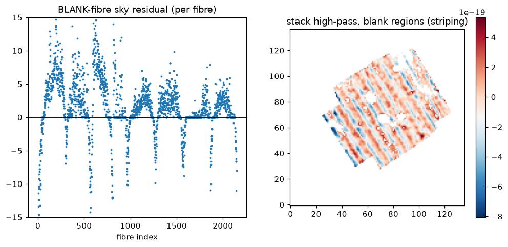
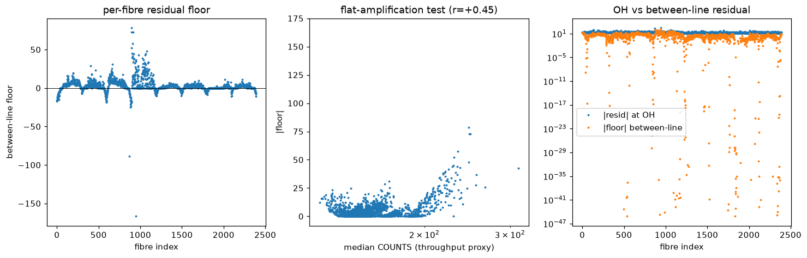
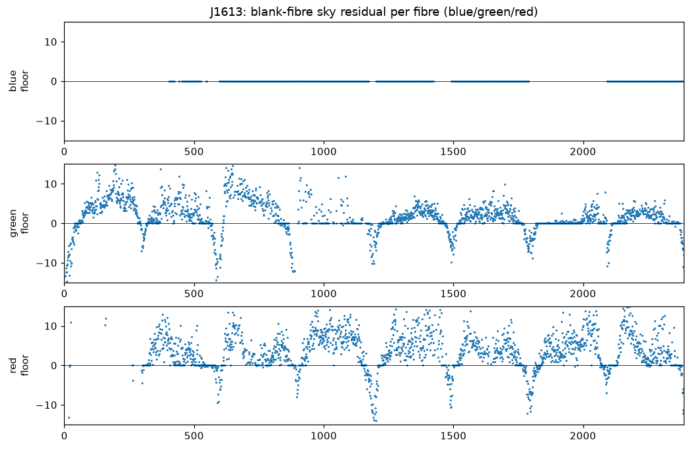

# Sky-subtraction striping — Phase 2 diagnosis (root cause)

Field: **J1613+0808**, green, 8 dithers (the deepest may26 field, worst striping). Analysis is on the
delivered RSS (`SKY`/`SKYSUB`/`COUNTS`/`MASK`) plus the combined green cube. Scripts:
`llamas_pyjamas/Sky/diagnosis/sky_residual_diag.py`.

## Root cause (summary)

The diagonal striping in stacked images is a **per-camera / per-fibre ADDITIVE sky-subtraction
residual**, coherent across dithers, that the rotated dither groups cross-hatch into diagonal stripes.
It has two parts:

1. a **positive interior floor** in each camera's fibres (~+1 count median, up to **+4–5 in benchsides
   1A and 2A**, ~0 in 4A/2B) — additive light the sky model does not capture; and
2. strong **negative dips at the slit/camera edges** (edge fibres over-subtract, down to ≈ −10 counts).

It is **additive, not a sky-scaling error**: on blank fibres the residual does **not** scale with the
sky-model level (`corr(floor, SKY) = −0.07`). An earlier apparent flux-dependence was an artefact of
object continuum contaminating source fibres (see caveat below), and vanishes on blank fibres.

In the stacked diffuse regime the striping is ~**1.9e-19 FLAM RMS — about 50% of the faint diffuse
signal** — so it is the limiting systematic for Lyα work, exactly as expected.

## Evidence

*Left: the sky-subtraction residual on blank fibres, per fibre — a repeating per-camera pattern
(positive interior floor + negative edge dips). Right: the stacked white-light high-pass in blank,
source-masked regions — the diagonal cross-hatch of the two rotation groups.*

*The residual floor is structured by benchside (1A/2A/2B elevated); OH-line residuals (~10 counts) are
a separate, fairly uniform component.*

Key measurements (J1613 green, blank fibres):
- residual floor median **+1.09**, MAD 1.4; per-benchside offsets 1A +4.2, 2A +4.8, 3B +1.6, … 4A ≈ 0.
- `corr(floor, SKY level) = −0.07` → additive, not multiplicative/throughput scaling.
- stacked blank-region high-pass RMS **1.9e-19 FLAM** (~50% of the core diffuse signal).

## What this points to (Phase 3 fix directions)

- **Slit-edge over-subtraction** (the negative dips): the sky-model amplitude/LSF is wrong for
  edge fibres — an across-slit LSF/throughput effect. This is what the **derivative refinement**
  (α·S + β·S′ + γ·S″) targets; but per RS's domain principle it should run in the **pkl/xshift
  domain**, not on the RSS in wavelength space.
- **Positive additive floor** (worst 1A/2A): a diffuse additive component (scattered continuum /
  instrumental floor) the OH-anchored sky model doesn't remove — needs a per-camera/per-fibre
  **continuum pedestal** term, or upstream scattered-light handling. Echoes the earlier
  between-line-residual root cause (diffuse scattered continuum, benches 1–2).
- Both are **per-camera coherent**, which is precisely why they survive co-adding and cross-hatch into
  stripes; a correct per-camera treatment should remove most of the striping.

## Generalization — all fields × channels

Verified the signature across J1613 / J2151 / J0958 and blue / green / red (blank fibres;
`verify_<field>.png`):

| field | chan | med floor | edge dip | corr(floor,SKY) | worst benchsides | stack stripe RMS |
|-------|------|-----------|----------|-----------------|------------------|------------------|
| J1613 | green | +1.1 | −6.4 | −0.07 | **2A/1A**/3B | 1.9e-19 |
| J1613 | red | +3.4 | −6.5 | +0.05 | **1A(+11)**/2B/3A | 1.4e-19 |
| J1613 | blue | ~0\* | — | — | metric-blind\* | 1.7e-19 (coherent, 12.6× noise) |
| J2151 | green | +0.6 | −4.8 | ~0 | **1A/2A**/3A | 1.9e-19 |
| J2151 | red | +2.6 | −5.5 | +0.15 | **1A(+15)**/2B/3A | 1.8e-19 |
| J2151 | blue | ~0\* | — | — | metric-blind\* | 2.7e-19 (coherent, 10.7× noise) |
| J0958 | green | +0.0 | −4.9 | −0.15 | **1A/2A**/3B | — |
| J0958 | red | +2.1 | −4.0 | +0.08 | **1A(+9)**/2B/4A | — |

**Green & red: confirmed and universal.** The additive per-camera floor + negative slit-edge dips
appear in every field. It is a **fixed instrumental pattern** — **1A/2A are consistently the worst**
(1A dominant in red, up to +11–15). **Red is worse than green** (larger additive floor). The residual is
additive in all cases (`corr(floor, SKY) ≈ 0`).

**\*Blue is different — and its striping is real.** The between-line-floor metric is *blind* in blue
because the blue continuum sky model is ≈0 (29–31% of "between-line" pixels are exact zeros), so it
reads a spurious 0. Measured on non-zero pixels, the blue per-fibre residual is *small* (+0.5, OH-
concentrated +1.5, ~uniform across benchsides) — **not** the green/red per-camera floor. **But the blue
stack striping is coherent at 10–13× the photon noise.** So blue has genuine striping from a **distinct,
not-yet-identified mechanism** (candidates: the large outlier tail — blue MAD 1 but std 115 — near-zero
continuum handling, or blue-only base-B-spline behaviour since the derivative stage skips blue). **Blue is
the Lyα channel, so this needs its own investigation** (Phase 2b) before a fix.

*Blue (top) reads flat-zero — the metric artifact; green (middle) and red (bottom) show the real
per-camera floor + slit-edge dips.*

## Caveats

- **Metric confound (resolved):** a "between-line floor" measured on *all* fibres is contaminated by
  real object continuum in source fibres (`corr(floor, object excess) = +0.88`). The clean signal is
  on **blank fibres only** — used for all conclusions here.
- **Run-to-run non-determinism:** the pipeline is not bit-reproducible at the extraction/wavelength
  level (WAVE/xshift jitter), so residual measurements carry some run-to-run scatter; the per-camera
  *pattern* is robust across the 8 dithers.
- Green/red now verified across all three fields (see Generalization). **Blue striping is real but its
  mechanism is unresolved** — the next diagnosis target (Phase 2b), and the one that matters most for Lyα.
